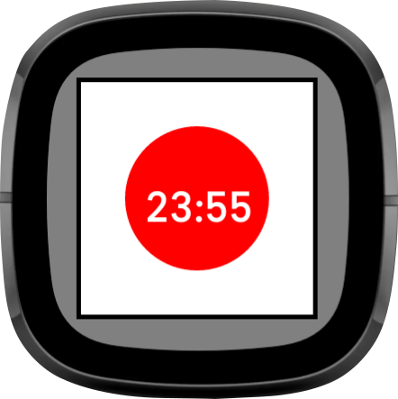

# 最初の開発

https://dev.fitbit.com/getting-started/

Fitbit SDKを使ってアプリやクロックフェイスを開発できます。

Fitbit SDKを使って開発をはじめるには下記が必要です。

1. Fitbitのアカウント
2. Fitbit OSまたはFitbit OSシミュレータ
3. Fitbitデバイスとペアリング済みのFitbiモバイルアプリ
4. Fitbit Studioにアクセス可能なPC
5. 無線ネットワーク

## シミュレータによる開発

シミュレータを使えばFitbitデバイスが無くても開発を行うことができます。ただし開発したアプリを公開するにはFitbitアカウントと関連付けられたFitbitデバイスが必要です。

## はじめての開発

1. [fitbit studio](https://studio.fitbit.com/)へアクセスします。"Start"を選択してログインします。

   

2. 今回はDigital Clockテンプレートを使って作成します。プロジェクト名を選択したらテンプレートを選択し"Create"を選択します。

   

   3. fitbitデバイスの接続設定をします。

      1. fitbitデバイスの設定画面から開発者ブリッジ接続を有効化します。ない場合はスマートフォンから開発者ブリッジ接続を有効化してから再度試します。
         [設定]→[開発者用ブリッジ接続]→[オンにする]

      2. fitbit studioからfitbitデバイスを選択します。正しく接続できるとconnectedと表示されます。

      3. "Run"をクリックしてfitbitデバイスからアプリを実行します。成功するとfitbitデバイスの時計が変わったことが確認できます。

         

### 時計の外観をカスタマイズする

jpgまたはpngファイルを時計の背景画像として使えます。デバイスごとの画像サイズは次の通りです。

Versa3またはSense : **336 x 336** px

Versa、Versa Lite、Versa2 : **300 x 300 **px

Ionic : **348 x 250** px

1. 画像ファイルをresourcesフォルダにドラッグアンドドロップします。

2. アップしたファイルを背景として使うためにindex.viewファイルに下記コードを追記します。"bg1.png"はアップしたファイル名です。

   ```xml
   <image href="bg1.png"/>
   ```

3. "Run"を選択してFitbitで変更内容を確認します。

   

   ### 時計のテキストをカスタマイズ

   時計のテキストなどをカスタマイズするにはstyle.cssを編集します。

   ```css
   .background {
     viewport-fill: gray;      /** 時計の背景色 **/
   }
   
   /** 時計の文字に関する設定 **/
   #myLabel {
     font-size: 130;             /** テキストサイズ **/
     font-family: System-Bold;   /** フォント **/
     text-length: 32;            /** ? **/
     text-anchor: middle;        /** テキストの配置基準位置 **/
     x: 50%;                     /** テキストの横方向配置位置 **/
     y: 50%+40;                  /** テキストの縦方向配置位置 **/
     fill: black;                /** テキストの色 **/
   }
   ```


## アプリのアンインストール

DeveloperBridgeを使ってインストールしたアプリはモバイルアプリの開発者メニューから削除できます。

# アプリケーションアーキテクチャ

## フォルダ構成

```
/app/
/common/
/companion/
/resources/
/settings/
```

## データサイズ

アプリのインストール時の最大サイズは10MBです。インストールされたアプリの最大サイズは15MBです。

## JavaScript

app、common、companionフォルダには.jsファイルまたは.tsファイルを格納できます。

settingsファイルにはindex.jsxという名前のReact JSXファイルを一つだけ格納します。

## プロジェクトフォルダ

### app(アプリケーション)フォルダ

デバイスで実行されるアプリケーションロジックが格納されます。appフォルダに格納されるコードはDevice APIへアクセスします。Device APIはプレゼンテーション層との通信やCompanionとの通信、設定情報の読み書きを提供します。

ビルドを正常に行うために単一のindex.jsまたはindex.tsファイルをappフォルダに格納してください。

### comapnion(コンパニオン)フォルダ

companionフォルダにはモバイルデバイスで実行されるロジックが格納されます。companionフォルダに格納されるコードはCompanion APIへアクセスします。Companion APIはインターネットへのリクエストや(モバイル?)アプリケーションとの通信を行います。

### common(Shared Code)フォルダ

applicationとcompanionで共通する要素を共有します。格納されるファイルはES6モジュールとして作成します。モジュールはapplicationとcompanionへロードされます。

### reources(Resources)フォルダ

アプリに含まれるすべてのリソースが格納されます。

#### /resources/index.view

fitbitアプリのUIを定義するSVGファイルです。このファイルは必須です。

#### /resources/widget.defs

不明。このファイルは必須です。

#### /resources/*.css

CSSファイルindex.viewファイルから<link>を使うことでインクルードできます。

#### /resources/*.png and /resources/*.jpg

index.viewから<image>を使うことで参照可能です。画像はプレゼンテーション層から使用できます。

## settings(Settings)フォルダ

React JSXによって記述されたアプリケーション設定ファイルを格納します。ユーザーが編集可能なコンフィグを定義できます。ファイルはSettings APIへアクセスします。


# 用語

## App/Application

Fibitで実行されるアプリです。アプリはアプリケーションロジックを定義する.jsまたは.tsファイル、SVGファイル、プレゼンテーション層で使用されるCSSから構成されます。

## Clock face

日時を表示するアプリを特に言います。デバイスは単一のClock faceを持ち、インストールはいつでも可能です。タッチイベントのみがサポートされます。

## Device API

デバイスのセンサーへのアクセスや通信を提供するJavaScriptAPIです。このAPIへのアクセスはapplicationコード(applicationフォルダに配置されるコード)からのみ可能です。

## SVG

アプリケーションの見た目に関する構造を定義します。

## Component

アプリに組み込み可能な定義済みのSVGコンポーネントです。時計やメニューバー、ボタンなどのサンプルを含みます。

## CSS

アプリの見た目にスタイル(色、フォント、位置やサイズなど)。Fitbitは標準的なWebCSSをベースにしていますがいくつか異なる実装があります。

## Companion

モバイルデバイスで実行されるJavaScriptプログラムです。ComapnionはFitbitデバイスとインターネットをブリッジします。Companionによってデータの送受信を行えます。またモバイルデバイス上で実行されるためFitbitデバイスによる制約を受けません。

## Comapnion API

データの送受信やモバイルデバイスでの処理を行うためのJavaScriptAPIです。

## Settings

ユーザーにモバイルデバイスからアプリの設定を変更できるようにします。

## Settings API

アプリケーション設定ページを生成するために使用されます。これはReact JSXによって実装されます。UIはモバイルアプリケーションで実装済みの見た目によってレンダリングされます。

## Fitbit Studio

ブラウザベースのIDEです。

## Developer Bridge

Fitbit Studio、Fitbitデバイスやモバイルアプリを接続するためのwebsocketです。アプリのインストールやIDEへのコンソールログの出力をするために使われます。

# SVG

## 座標系

fitbitデバイスの座標系は原点が左上、縦横ともに335pxです。


またsvg要素によってグループ化した場合、子要素の座標は親要素が基準となります。

```xml
<svg class="background">
  <svg x="10%" y="10%" width="80%" height="80%" >
    <rect x="0" widht="0" width="100%" height="100%" fill="black"/>
    <rect x="5" y="5" width="100%-10" height="100%-10" fill="white"/>
    <circle cx="50%" cy="50%" r="80" fill="red" />
  </svg>
  <text id="myLabel" />
</svg>
```



代わりにsection要素をコンテナとして使うこともできます。この場合使用できる属性はx,y,width,heigtです。特にsvg要素を使う必要がなければメモリを節約できます。

子要素に座標変換を適用したい場合はg要素が使えます。g要素の子要素に対して移動、回転、スケールを適用できます。

またanimateTransformを使うことで座標変換をアニメーションできます。

```xml
<!-- 画面の中央で四角形を回転するアニメーション -->
<svg class="background">
  <g transform="translate(50%,50%)">
     <animateTransform attributeType="rotate" from="0" to="360" dur="2"/>
     <rect x="-100" y="-100" width="200" height="200" fill="black"/> 
  </g>
</svg>
```


## 図形を描画する

矩形を描画するにはrect要素を使います。

```
<!--index.view>
<!-- DigitalClockテンプレートで作成したindex.viewに追記 -->

<svg class="background">
  <rect x="0"   y="0" width="112" height="100%" fill="blue" /> <!-- 追記 -->
  <text id="myLabel" />
  <rect x="224"   y="0" width="112" height="100%" fill="green" /> <!-- 追記 -->
</svg>
```

text要素の前後にrect要素を追記しました。要素の描画順は上から順に描画されます。そのため下図のように青色の矩形は文字の後ろに、緑色の矩形は文字の上に重ねて描画されます。


サポートされている属性は次の通りです。

x,y,width,height,fill,opacity,visibility,display
